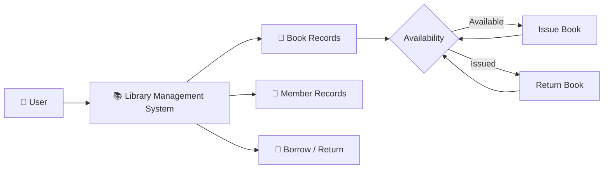
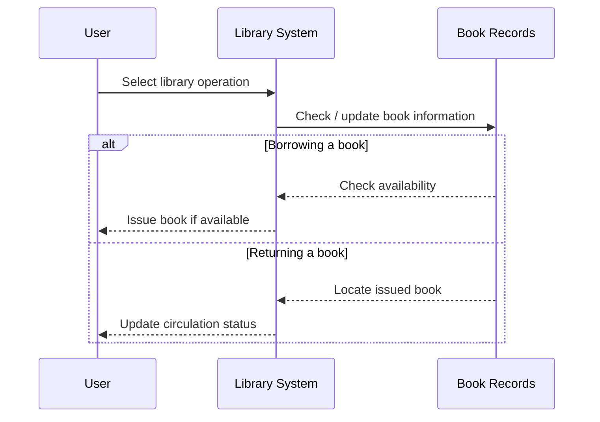

# 📚 Library Management System

> A C++ desktop application designed to simplify basic library operations by organizing books, managing records, and handling borrowing and returning workflows.


---

## 📖 From Bookshelf to System

A library may look simple from the outside:

**Find a book → Borrow it → Return it.**

Behind those actions, however, there is information that needs to be tracked consistently.

This project turns that basic workflow into a **C++-based management application**, providing a practical way to explore how programming fundamentals can be applied to a real-world record-management problem.

The system focuses on organizing library information and making everyday operations easier to manage from a single application.

---

## 🔄 The Library Workflow

```text
                    ┌─────────────────┐
                    │     LIBRARY     │
                    └────────┬────────┘
                             │
              ┌──────────────┼──────────────┐
              ↓              ↓              ↓
        ┌───────────┐  ┌───────────┐  ┌────────────┐
        │   Books   │  │  Members  │  │Transactions│
        └─────┬─────┘  └─────┬─────┘  └──────┬─────┘
              │              │               │
              └──────────────┼───────────────┘
                             ↓
                    ┌─────────────────┐
                    │ Library Actions │
                    └────────┬────────┘
                             │
                    ┌────────┴────────┐
                    ↓                 ↓
               📖 Borrow          ↩️ Return
```

The central idea is simple: **library information and library actions are connected**.

---

## 🧩 What the System Covers

### 📖 Book Management

The application provides a way to work with the library's book records and organize the available information.

Typical operations revolve around:

* Adding book information
* Viewing available records
* Searching for books
* Managing book details

### 👥 Member Management

Library members can be represented through their own records, allowing the system to associate library activity with the appropriate user.

### 🔁 Borrow & Return

The core library workflow revolves around circulation:

```text
Book Available
      │
      ▼
   Borrow
      │
      ▼
Book Issued
      │
      ▼
   Return
      │
      ▼
Book Available Again
```

This makes the project a practical exercise in representing **state changes** through program logic.

---

## 🧠 The C++ Side

Unlike my Python-based management-system projects, this application was built using **C++**, making it part of my earlier exploration of programming fundamentals and structured application development.

The project provided practice with concepts such as:

```text
Variables
   ↓
Conditions
   ↓
Loops
   ↓
Functions
   ↓
Data Structures
   ↓
Program Flow
   ↓
Management System
```

Rather than treating C++ concepts as isolated exercises, this project applies them to a recognizable real-world scenario.

---

## 🏛️ System Model

A simplified representation of the system can be viewed as:



This model captures the central relationship between **books, users and circulation**.

---

## 🗂️ Information Flow



---

## 🛠️ Technology

| Component            | Technology                                |
| -------------------- | ----------------------------------------- |
| Language             | **C++**                                   |
| Application Type     | Desktop / Console-based management system |
| Programming Approach | Procedural / structured programming       |
| Build Artifact       | `LMS.exe`                                 |

The project is intentionally lightweight and focuses on applying **core C++ programming concepts** to a practical application.

---

## 📁 Project Structure

```text
Library-Management-System/
│
├── lms.cpp              # Main C++ source code
├── LMS.exe              # Compiled Windows executable
├── requirements.txt     # Project information
├── .gitignore           # Git ignore rules
└── README.md            # Project documentation
```

### Main Components

**`lms.cpp`**

Contains the core implementation of the Library Management System.

**`LMS.exe`**

A compiled Windows executable that allows the application to be run without compiling the source manually.

---

## ▶️ Running the Project

### Option 1 — Run the executable

On Windows, the simplest option is to launch:

```text
LMS.exe
```

### Option 2 — Compile from source

If a C++ compiler such as `g++` is available:

```bash
g++ lms.cpp -o LMS
```

Then run:

```bash
./LMS
```

On Windows:

```bash
LMS.exe
```

---

## 🧭 A Simple Mental Model

The application can be understood through three questions:

```text
┌──────────────────────────────┐
│  WHAT EXISTS?                │
│  → Books & Members           │
└──────────────┬───────────────┘
               ↓
┌──────────────────────────────┐
│  WHAT IS HAPPENING?          │
│  → Borrow / Return           │
└──────────────┬───────────────┘
               ↓
┌──────────────────────────────┐
│  WHAT SHOULD CHANGE?         │
│  → Availability / Records    │
└──────────────────────────────┘
```

This way of thinking helped connect programming logic with the behavior of a real-world system.

---

## 💭 Why I Built It

Management systems are useful beginner projects because they force programming concepts to work together.

Instead of solving a single isolated problem, the program needs to:

* Accept user input
* Make decisions
* Organize information
* Perform operations
* Maintain a logical flow
* Respond to different scenarios

A library is a natural environment for practicing these ideas because its operations are easy to understand while still requiring structured program logic.

---

## 🚀 Possible Next Version

If I revisit this project, the next version could evolve beyond the original implementation with:

* 🗄️ Database-backed storage
* 👤 Member authentication
* 📊 Book availability dashboard
* 🔎 Advanced search and filtering
* 📅 Due-date tracking
* ⏰ Overdue calculation
* 💰 Fine management
* 📚 Book categories and authors
* 🧾 Borrowing history
* 🖥️ Modern GUI
* 🧪 Automated testing

A database-backed version would be the natural next step toward turning the project into a more complete library information system.

---

## 🎓 A Piece of My Programming Foundation

This project represents an earlier stage of my programming journey, where I was learning how to take **fundamental C++ concepts and turn them into a working application**.

It sits alongside my Python management-system projects as part of my broader programming foundation:

```text
C++ Fundamentals
       │
       ├── Logic
       ├── Functions
       ├── Data Handling
       └── Program Structure
                │
                ▼
       Real-World Application
                │
                ▼
       Library Management System
```

The project is simple by design, but it represents an important step from **learning syntax** to **building systems**.

---

⭐ **Built as part of my programming foundations journey.**

